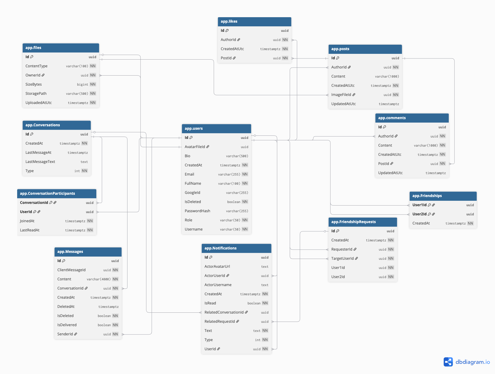

# Transcendence

> This project has been created as part of the **42 curriculum** by [dpadenko], [mmasarov], [bvalerii] and [dcingoz].

> A modern, full-stack social platform built as the **ft_transcendence** capstone project at **42 Vienna**.

Transcendence is a private social application that brings together authentication, profiles, posts, comments, likes, friend management, file uploads, notifications, and real-time chat under a single, coherent product. The repository is split into a strongly-typed React frontend and a layered .NET backend, glued together by an OpenAPI-driven contract.

---

## Table of contents

1.  [Project at a glance](#project-at-a-glance)
2.  [Team](#team)
3.  [Project management](#project-management)
4.  [Selected modules and point calculation](#selected-modules-and-point-calculation)
5.  [Features and ownership](#features-and-ownership)
6.  [Technology stack and justifications](#technology-stack-and-justifications)
7.  [Architecture overview](#architecture-overview)
8.  [Database schema](#database-schema)
9.  [Individual contributions](#individual-contributions)
10. [Getting started](#getting-started)
11. [Repository structure](#repository-structure)
12. [Running the application](#running-the-application)
13. [Database operations](#database-operations)
14. [API overview](#api-overview)
15. [Frontend notes](#frontend-notes)
16. [Security considerations](#security-considerations)
17. [Troubleshooting](#troubleshooting)
18. [Credits and license](#credits-and-license)
19. [Resources](#resources)
20. [Use of AI](#use-of-ai)

---

## Project at a glance

| | |
|---|---|
| **Name** | Transcendence |
| **School** | 42 Vienna |
| **Project** | ft_transcendence |
| **Team size** | 4 |
| **Total points** | 15 |
| **Live demo** | https://localhost:8443 |

## Team

| Member | Role | GitHub | Primary focus |
|---|---|---|---|
| **Deniz** | **Product Owner (PO) & Project Manager (PM)** | [@denniscingoz](https://github.com/denniscingoz) | Vision, scope, acceptance criteria, design, planning, coordination, delivery |
| **Daria** | **Tech Lead** | [@grignetta](https://github.com/grignetta) | Architecture, code review, technical direction, database |
| **Valeriy** | **Backend Developer** | [@Vbezhevets](https://github.com/Vbezhevets) | Realtime features with SignalR |
| **Michaelaela** | **Frontend Developer** | [@Michaelaela811](https://github.com/Michaelaela811) | Frontend application |

> _Roles were assigned at kickoff and remained stable through the project. All members contributed to code, and everyone tested the system and fixed bugs across the codebase; the role headings indicate primary responsibility, not exclusive ownership._

---

## Project management

Given the small team size and fixed academic deadline, we kept coordination deliberately lightweight. Day-to-day communication happened in a shared WhatsApp group, with occasional calls for deeper discussions or design decisions. Roles were assigned at kickoff and everyone contributed to code, testing, and bug fixing.

### How work was organised

- **Discovery phase (week 1).** Requirements walk-through, scope agreement, module selection, and a target point total. Wireframes and a domain model were produced before any code was written.
- **API-first contract.** Backend and frontend agreed on endpoint shapes, payloads, and auth flows **before** parallel implementation began. This single decision unblocked nearly all parallel work.
- **Documentation discipline.** `docs/` is split by audience - `api/`, `back end/`, `front/`, `db_schema/`, and `minor/`.
- **Task tracking.** Work items were captured as GitHub issues against the repo and assigned at kickoff, then reallocated as scope shifted. We did not run formal sprints, coordination was continuous rather than time-boxed.
- **Branching strategy.** Trunk-based development with short-lived feature branches, pull requests into `main`, and review before merge to keep history readable.
- **Communication.** Async-first via a shared WhatsApp group for day-to-day coordination: blockers, asks, progress updates, supplemented by occasional calls for design discussions and harder problem solving. This kept overhead low and let each member work in long uninterrupted blocks.
- **Quality gates.** Pre-commit linting on the frontend, EF Core migrations reviewed by the Tech Lead or Project owner before merge, and code review on every pull request. All members contributed to testing and bug fixing across the codebase.
- **Deployment workflow.** Local development through Docker Compose; production-like environment behind Nginx with self-signed TLS for end-to-end testing of the SignalR chat layer.

### Tooling

- **Source control:** Git + GitHub
- **Tracking:** _GitHub Projects Issues_
- **Communication:** _Whatsapp group_
- **Design:** 
  - [Main Figma file](https://www.figma.com/proto/CHmG51ysucilKi9Y2d2JpK/SocialLink-Social-media-Application-UI--Community-?node-id=224-527&t=QZm5JHExFhO5kVTK-0&scaling=contain&content-scaling=fixed&page-id=0%3A1)
  - [Wireframes / User flows](https://www.figma.com/design/CHmG51ysucilKi9Y2d2JpK/SocialLink-Social-media-Application-UI--Community-?node-id=0-1&p=f)
- **Documentation:** in-repo Markdown under `docs/`

---

## Selected modules and point calculation

ft_transcendence is scored in **module-credits**:

- **1 Major module = 2 module-credit**
- **1 Minor module = 1 module-credits**

We selected **4 Major** and **6 Minor** modules for a total of **8 module-credits = 15 points TOTAL**.

### Major modules (4 × 2.0 = 8.0 module-credits)

| # | Module | How we satisfied it |
|---|---|---|
| **M1** | **Use a framework for both frontend and backend** | React + Vite + TypeScript on the frontend; ASP.NET Core Web API on the backend. Both go beyond minimal usage (routing, dependency injection, middleware, custom hooks). |
| **M2** | **Real-time features (WebSockets / similar)** | **SignalR** powers the chat hub at `/hubs/chat`, with graceful connect/disconnect handling, automatic reconnection on the client, and group-based broadcasting that targets only the participants of each conversation. |
| **M3** | **Users can interact with other users** | Chat (1:1 conversations with message history), profile pages (own + others), and a complete friends system (send / accept / decline / remove requests). |
| **M4** | **Standard user management and authentication** | Email + password sign-up and sign-in with JWT, profile editing, avatar upload with a default fallback, friends with live online status, and a public profile page per user. |

### Minor modules (7 × 1.0 = 7.0 module-credits)

| # | Module | How we satisfied it |
|---|---|---|
| **m1** | **Complete notification system** | Notifications generated for friend requests, friend request accept/decline, post likes, post comments, and new chat messages. Persisted in the database, pushed in real time via SignalR, with an unread counter and mark-as-read endpoints (single, all, by conversation). |
| **m2** | **File upload and management** | Multi-type upload (images and videos), client-side **and** server-side validation (MIME type, size, magic-byte check), friends-only access control, in-app preview for both images and videos, upload progress overlay, and deletion. |
| **m3** | **Multi-language support (≥ 3)** | i18next-powered i18n with three complete translations (EN, ES, FR), a UI language switcher, and full coverage of user-facing strings. |
| **m4** | **Remote authentication (OAuth 2.0)** | Google sign-in via OAuth 2.0, integrated with the JWT issuance flow so federated and local accounts share a single identity model. |
| **m5** | **Custom-made design system** | A reusable UI layer built on Tailwind tokens: layout components (`Layout`, `Header`, `BottomNav`), generic widgets (`Modal`, `Field`, `LanguageDropdown`, `UploadProgressOverlay`, `ProtectedPostThumb`), and domain modals (`PostDetailModal`, `LikesModal`, `NotificationsModal`, `SearchModal`, `SettingsModal`) — plus a shared CSS utility layer in `index.css` (`.btn-*`, `.input`, `.card`, `.panel`, `.divider`, `.message-*`). |
| **m6** | **Use an ORM** | **Entity Framework Core** with code-first migrations. |
| **m7** | **Support for additional browsers** | The app is tested and verified to work in **Chrome, Firefox, Safari** with consistent UI/UX. All features (chat, real-time presence, file upload, OAuth popup, i18n) function identically across browsers. Any browser-specific limitations are documented in `docs/browser-support.md`. |


---

## Features and ownership

| Area | Feature | Frontend | Backend | Status |
|---|---|---|---|---|
| **Auth** | Email/password sign-up & sign-in | Michaela | Deniz | ✅ |
| | Google OAuth 2.0 sign-in | Michaela | Deniz | ✅ |
| | JWT issuance + sign-out | Michaela | Deniz | ✅ |
| **Profile** | View own profile | Michaela | Deniz | ✅ |
| | View other users' profiles | Michaela | Deniz | ✅ |
| | Edit profile + change password | Michaela | Deniz | ✅ |
| | Avatar upload with default fallback | Michaela | Deniz | ✅ |
| | Account deletion | Michaela | Deniz | ✅ |
| | User search | Michaela | Deniz | ✅ |
| **Posts** | Feed (cursor-paginated) | Michaela | Deniz | ✅ |
| | Profile posts (own + other users) | Michaela | Deniz | ✅ |
| | Create / delete post | Michaela | Deniz | ✅ |
| | Comments (cursor-paginated) | Michaela | Deniz | ✅ |
| | Likes + likes list | Michaela | Deniz | ✅ |
| **Friends** | Send / accept / decline requests | Michaela | Deniz | ✅ |
| | Friends list (cursor-paginated) + remove | Michaela | Deniz | ✅ |
| **Presence** | Online users tracking | — | Valerii | ✅ |
| | Online status in friends list & chat | Michaela | Valerii | ✅ |
| | Presence broadcast on connect/disconnect | — | Valerii | ✅ |
| **Files** | Upload with type/size/magic-byte validation | Deniz | Deniz | ✅ |
| | Friends-only access control | — | Deniz | ✅ |
| | Image/video preview + upload progress | Deniz | — | ✅ |
| | Delete uploaded files | Deniz | Deniz | ✅ |
| **Notifications** | Persisted notifications (DB) | Michaela | Valerii | ✅ |
| | Realtime notification events (SignalR) | Michaela | Valerii | ✅ |
| | Unread counter | Michaela | Valerii | ✅ |
| | Mark as read (single, all, by conversation) | Michaela | Valerii | ✅ |
| **Chat** | Real-time messaging via SignalR | Michaela | Valerii | ✅ |
| | Conversation list + message history (paginated) | Michaela | Valerii | ✅ |
| | Read / delivery receipts | Michaela | Valerii | ✅ |
| | Soft-delete messages | Michaela | Valerii | ✅ |
| | Delete conversations | Michaela | Valerii | ✅ |
| | Reconnection handling | Michaela | Valerii | ✅ |
| **i18n** | Translation files (EN, ES, FR) | Michaela | — | ✅ |
| | Runtime language switcher | Michaela | — | ✅ |
| **Design system** | Reusable UI components (Modal, BottomNav, Field, LanguageDropdown, UploadProgressOverlay, ProtectedPostThumb, …) | Michaela | — | ✅ |
| | Shared CSS utilities (`.btn-*`, `.input`, `.card`, `.panel`, `.divider`, `.message-*`) | Michaela | — | ✅ |
| **Infra** | Docker Compose (db + api + nginx) | — | Daria | ✅ |
| | Nginx reverse proxy + WebSocket upgrade | — | Daria, Valeriy | ✅ |
| | Local TLS certs (self-signed) | — | Daria | ✅ |
| | DB backup / restore scripts | — | Daria | ✅ |
| | EF Core migrations applied on startup | — | Daria | ✅ |

---

## Technology stack and justifications

### Backend — .NET / ASP.NET Core

| Choice | Why |
|---|---|
| **ASP.NET Core Web API** | Mature, cross-platform, opinionated. Strong typing end-to-end and excellent OpenAPI tooling support. |
| **C# / .NET 8** | Performance, a rich Base Class Library - ideal for WebSocket-heavy workloads. |
| **Entity Framework Core (Npgsql)** | Code-first migrations, and a strict mapping layer between domain models and persistence — directly satisfies the **ORM minor module**. |
| **SignalR** | Battle-tested abstraction over WebSockets with built-in transport fallback, group/user targeting, and reconnection — drastically reduces the surface area of the **real-time major module**. |
| **JWT bearer auth** | Stateless, plays well with SPAs, and integrates cleanly with both local and Google OAuth identity flows. |
| **Google.Apis.Auth** | Server-side verification of Google ID tokens before issuing our own JWT. |
| **Swagger / OpenAPI** | Auto-generated API documentation for development and debugging. |

### Frontend — React + TypeScript

| Choice | Why |
|---|---|
| **React + Vite** | Fast dev server, instant HMR, ecosystem maturity. Vite's ESM-native dev experience is materially faster than CRA/webpack for a project this size. |
| **TypeScript** | Catches whole classes of bugs at compile time, especially around API payload shapes that match the backend DTOs. |
| **React Router** | Declarative routing with nested routes, naturally maps to our protected-route model via `RequireAuth`. |
| **TanStack Query** | Eliminates server-state boilerplate (cache, dedupe, retries, refetch) and powers all data fetching across feed, posts, comments, friends, and profile. |
| **React Hook Form** | Lightweight form state and validation for the sign-in / sign-up flows. |
| **Axios** | Interceptors for token attachment and 401 handling. |
| **`@microsoft/signalr` client** | Official client for the chat hub, with auto-reconnect wired through `RealtimeProvider`. |
| **`@react-oauth/google`** | Drop-in Google sign-in button that returns an ID token for backend verification. |
| **i18next** | Industry-standard i18n with runtime language switching across three languages — directly satisfies the **multi-language minor module**. |
| **Mock Service Worker** | Lets the frontend run end-to-end without the backend, which unblocked parallel work and gave us a reliable demo fallback. |
| **Tailwind CSS** | Utility-first, design-system-friendly. Tailwind tokens back our **custom design system minor module**. |

### Infrastructure

| Choice | Why |
|---|---|
| **Docker Compose** | One-command spin-up for the database, API, and reverse proxy. Reproducible across team machines. |
| **Makefile** | Thin wrapper around the common Docker Compose flows (`make up`, `make down`, `make fclean`, `make backup-db`, `make restore-db`). Hides container plumbing behind a single shared interface so every team member runs the same commands. |
| **Nginx** | Reverse proxy, TLS termination, and WebSocket upgrade handling for SignalR. |
| **PostgreSQL 16** | Mature, strict, and a great fit for the relational shape of our domain (users, friendships, posts, comments). |
| **Self-signed dev certificates** | Necessary for testing TLS and secure WebSocket flows locally without a public domain. |

---

## Architecture overview

```
┌──────────────────────┐        ┌──────────────────────────┐
│      Browser         │ HTTPS  │          Nginx           │
│  React SPA (Vite)    │ ◄────► │   reverse proxy + TLS    │
│  TanStack Query      │  WSS   │   /api  → API container  │
│  SignalR client      │        │   /hubs → API container  │
└──────────────────────┘        │   /     → static SPA     │
                                └────────────┬─────────────┘
                                             │
                                             ▼
                       ┌─────────────────────────────────────┐
                       │     Transcendence.Api (ASP.NET)     │
                       │  Controllers · SignalR Hubs · Auth  │
                       └─────┬─────────────────────┬─────────┘
                             │                     │
                             ▼                     ▼
              ┌────────────────────────────┐   ┌──────────────────────────────┐
              │ Transcendence.Application. │   │ Transcendence.Infrastructure │
              │  Service contracts         │   │  EF Core · repositories      │
              │  Use cases · DTOs          │ ◄─│  File storage · JWT gen      │
              └────────────┬───────────────┘   └──────────────┬───────────────┘
                           │                                  │
                           ▼                                  ▼
              ┌─────────────────────────┐        ┌──────────────────────────┐
              │  Transcendence.Domain   │        │   PostgreSQL 16          │
              │  Entities · core rules  │        │   + /app/uploads         │
              └─────────────────────────┘        └──────────────────────────┘
```

**Why this layering?** It keeps the **Domain** pure, no framework, no database, no HTTP, so the business rules can be reasoned about on their own. **Application** sits on top, defining the use cases and the contracts that the outer layers must satisfy. **Infrastructure** implements those contracts against EF Core, the filesystem, and external services like Google Identity. **Api** is the thin edge that translates HTTP requests and SignalR messages into Application calls.

The dependency arrows all point *inward*: Api and Infrastructure depend on Application, Application depends on Domain, and Domain depends on nothing. That's the rule that makes the rest of the design work, swapping Postgres for another database, or HTTP for a CLI, would only touch the outer layers.

In practice this means new features tend to slot in along predictable seams: a new entity in Domain, a service interface in Application, an EF Core configuration and repository in Infrastructure, and a controller (or hub method) in Api. The shape is repetitive on purpose.

---

## Database schema



---

### Schema Architecture

Project Transcendence is a social platform whose database is organized around **five domains**: identity, social feed, friendships, chat, and notifications. All tables live in PostgreSQL under the `app` schema and are managed via EF Core migrations.

#### Identity

Identity is the foundation. Every `users` row supports either password or Google SSO authentication, enforced by a check constraint requiring at least one of `PasswordHash` or `GoogleId` to be set. Each user links optionally to an avatar in the `files` table.

`files` is a central table that stores all uploaded files (images, avatars, etc.) — every uploaded asset gets a row, owned by a user, with cascade deletion when that user is removed.

#### Social Feed

The social feed is a classic **posts / comments / likes** triangle:

- A post **must** carry an image. The FK to `files` uses `RESTRICT` - the database prevents deleting an image if it is still used by a post, ensuring that posts always have a valid image.
- The `likes` table has a unique index on `(PostId, AuthorId)`, so a user can only like a given post once.
- Cascading deletes on `PostId` clean up comments and likes when a post is removed.

#### Friendships

Friendships use a **pair-normalization trick**. Both `Friendships` and `FriendshipRequests` enforce `User1Id < User2Id` so each pair exists exactly once in canonical order. This has two payoffs:

- "Are A and B friends?" becomes a single index lookup instead of an OR query.
- A→B and B→A friend requests collide on a unique index — you can't have two pending requests between the same two users.

The **original direction** of a request is preserved separately via `RequesterId` and `TargetUserId`. Self-friendships are blocked by `CHECK (RequesterId <> TargetUserId)`.

#### Chat

Chat supports both **direct (1-to-1)** and **group** conversations via a `Type` discriminator on `Conversations`. Participation is a join table with per-user `LastReadAt` for cheap unread-count queries.

Messages carry a client-generated `ClientMessageId` so **retries are idempotent**: the unique index on `(SenderId)` prevent duplicates. If the same message is sent multiple times (for example due to network retries), the database recognizes it and stores only one copy..

Deleted messages are **soft-deleted** (`IsDeleted` + `DeletedAt`) to keep threading and read pointers consistent.

#### Notifications

Notifications store a snapshot of the sender’s username and avatar at the time they are created. This allows the frontend to display notifications without additional queries, and ensures older notifications remain unchanged even if the user later updates their profile. Each notification has a Type field to distinguish different events, such as: new message, friend request, accepted, declined, post liked, and post commented.

---

### Individual contributions

## Michaela — Frontend Developer

- **Application shell & routing.** Set up the Vite + React + TypeScript project, the routing tree, the `RequireAuth` protected-route wrapper, and the `RealtimeProvider` that mounts the SignalR client at the right point in the lifecycle.
- **Custom design system.** Built the reusable UI layer on Tailwind tokens — layout components (`Layout`, `Header`, `BottomNav`), generic widgets (`Modal`, `Field`, `LanguageDropdown`, `UploadProgressOverlay`, `ProtectedPostThumb`), and domain modals (`PostDetailModal`, `LikesModal`, `NotificationsModal`, `SearchModal`, `SettingsModal`) — together with a shared CSS utility layer in `index.css` (`.btn-*`, `.input`, `.card`, `.panel`, `.divider`, `.message-*`). Satisfies the **custom design system** Minor module.
- **Feature pages.** Feed, post creation, post detail, comments, likes, profile (own + others), edit profile, settings, friends, friend requests, and online status indicators.
- **Real-time chat UI.** Conversation list, message thread, send/receive, reconnection handling, and presence integration with the SignalR client.
- **Notifications UI.** Inbox, unread counter, mark-as-read, and surface integration across the app.
- **Internationalisation.** Wired i18next with three complete translations (EN, ES, FR) and built the language switcher — covering the **multi-language** Minor module.
- **Mock-mode harness.** Set up MSW so the frontend could run end-to-end without the backend, which unblocked parallel work and gave us a reliable demo fallback.
- **Tooling.** ESLint config, Tailwind setup, TypeScript strict-mode, and the `frontend/.env` contract.

## Deniz — Product Owner & Backend Developer

- **Product ownership and planning.** Defined the product direction for *The SOCIAL* as a social networking platform, shaped the feature scope, selected the module strategy with the team, and translated the subject requirements into concrete product goals, acceptance criteria, timelines, and demo flows.
- **Project management.** Organised the role division, feature ownership, sprint priorities, review cycles, and coordination between backend, frontend, realtime, infrastructure, and design work. Tracked blockers, clarified responsibilities, and kept the project aligned with evaluation requirements.
- **Design, concept, and architecture decisions.** Contributed to the product concept, user flows, frontend architecture decisions, and full-stack structure: React, ASP.NET Core, Clean Architecture, EF Core, PostgreSQL, SignalR, Docker, Nginx, Axios, TanStack Query, and JWT authentication.
- **Application layer.** Implemented the main backend services for user-facing features: `AuthService`, `ProfileService`, `PostsService`, `PostsFeedService`, `PostsProfileService`, `FriendsService`, and `FilesService`.
- **Controllers and CRUD API surface.** Built controller actions for authentication, profiles, posts, friends, and files, including CRUD-style endpoints, request/response DTOs, validation contracts, protected routes, and consistent API behaviour.
- **Pagination and feed flow.** Implemented cursor-based pagination contracts and supported infinite-scroll flows for feeds, profile posts, search results, comments, and other paginated data consumed by the frontend.
- **Domain rules and entities.** Implemented core business rules: no self-friendships, no duplicate friend requests, friends-only access where required, idempotent like/unlike, profile access rules, file privacy rules, and soft-delete behaviour for posts and comments.
- **Authentication and security.** Implemented server-side email/password authentication with password hashing, Google OAuth verification, JWT integration, protected endpoint handling, and shared identity flow for local and federated accounts.
- **File upload and management.** Connected file uploads to avatars and posts, added validation and access rules, supported image/video preview, upload progress indicators, deletion flows, and private file access based on friendship and ownership rules.
- **Frontend-backend integration.** Built typed API clients under `src/api/`, configured Axios token attachment and 401 handling, and connected TanStack Query hooks to backend features such as auth, profile, posts, friends, files, notifications, and chat-related APIs.
- **Code review and quality control.** Read and reviewed code across project areas, questioned unclear implementations, requested revisions, accepted completed work, and tested feature behaviour against the planned user flows.

## Daria — Tech Lead & Backend Foundation

- **Clean Architecture.**  Organized the backend into Api, Application, Domain, and Infrastructure projects to separate business logic, persistence, and HTTP concerns.
- **Database & ORM (EF Core).** Designed the PostgreSQL database schema, created the TranscendenceDbContext, configured entity relationships, and wrote the EF Core migrations for users, posts, friendships, messages, and notifications.
- **Repository layer.** Implemented the persistence side of every `I*Repository` interface defined in Application — `UserRepository`, `PostsRepository`, `FriendsRepository`, `MessageRepository`, `NotificationRepository`, and the rest.
- **Dockerized deployment.** Built the Docker Compose setup for the API, PostgreSQL database, and Nginx reverse proxy, and created the root Makefile so the whole project can be started with a single command.
- **Nginx & HTTPS setup.** Configured Nginx to serve the frontend, forward API requests to ASP.NET, enable HTTPS with self-signed certificates, and support SignalR real-time connections.
- **Tech Lead responsibilities.** Reviewed backend pull requests, helped define architecture decisions, and assisted the team with debugging and backend integration issues.

## Valerii — Backend Developer (Realtime & Notifications)

- **Realtime ownership.** Was responsible for realtime features across chat, presence, and notifications.
- **SignalR foundation.** Designed and implemented the SignalR-based realtime functionality.
- **ChatHub lifecycle.** Implemented the ChatHub connection lifecycle — authentication, conversation groups, and connect/disconnect handling.
- **Chat message flow.** Implemented the realtime chat message pipeline: persistence, broadcasting, acknowledgements, read/delivery receipts, soft-delete, and conversation deletion support.
- **Presence tracking.** Implemented online users, friends/chat online status, and connect/disconnect broadcasts.
- **Notification pipeline.** Implemented the realtime notification flow — persisted notifications, SignalR push events, unread counters, and mark-as-read behavior.
- **Frontend integration.** Integrated realtime updates with the chat, friends, presence, and notification features on the frontend.
- **Reconnection handling.** Implemented reconnection handling for presence, unread counters, and realtime state synchronization.

---

## Getting started

### Requirements

| Tool | Version |
|---|---|
| Docker + Docker Compose | latest stable |
| Node.js | 18+ |
| npm | 9+ |
| .NET SDK | 8.0 |

For the Docker-based flow, Docker is the only hard requirement. The frontend can also be run separately with Vite during development.

### Environment setup

Create the root environment file:

```bash
cp .env.example .env
```

Then update the values in `.env`:

```env
POSTGRES_DB=trans_db
POSTGRES_USER=postgres
POSTGRES_PASSWORD=change_me
JWT_KEY=change_me_to_a_long_random_secret_key
JWT_ISSUER=TranscendenceApi
JWT_AUDIENCE=TranscendenceFrontend
JWT_EXPIRY_MINUTES=60
GOOGLE_CLIENTID=your_google_client_id_here
```

For the frontend:

```bash
cd frontend
cp .env.example .env
```

Example frontend values:

```env
VITE_USE_MOCKS=false
VITE_GOOGLE_CLIENT_ID=your_google_client_id_here
VITE_API_BASE_URL=/api
```

> **Never commit real secrets.** The `.env` files are git-ignored. Rotate `JWT_KEY` and your Google client secret if they ever leak.

---

## Repository structure

```text

├── backend/
│   ├── Transcendence.Api/              # HTTP API, controllers, SignalR hubs
│   ├── Transcendence.Application/      # Use cases, service contracts
│   ├── Transcendence.Domain/           # Entities, core models, business rules
│   ├── Transcendence.Infrastructure/   # EF Core, repositories, persistence, storage
│   └── Transcendence.sln
├── backups/                            # DB dumps (git-ignored)
├── docker/
│   ├── nginx/
│   │   ├── certs/                      # Local development TLS certificates
│   │   ├── default.conf                # Reverse proxy + WebSocket upgrade rules
│   │   └── Dockerfile
│   └── scripts/
│       ├── check-env.sh                # Verifies required env vars are present
│       ├── generate-certs.sh           # Issues local self-signed certs
│       ├── backup-db.sh                # pg_dump wrapper
│       └── restore-db.sh               # pg_restore wrapper
├── docs/
│   └── db_schema/                      # ER diagrams, schema drafts
│       ├── DB_schema.jpg
│       └── schema.dbml
├── frontend/
│   ├── public/                         # Static assets
│   ├── src/
│   │   ├── api/
│   │   ├── app/
│   │   ├── auth/
│   │   ├── components/
│   │   ├── hooks/
│   │   ├── i18n/
│   │   ├── mocks/
│   │   ├── pages/
│   │   ├── realtime/
│   │   ├── types/
│   │   ├── utils/
│   │   ├── index.css
│   |   └── main.tsx
│   ├── .env.example
│   ├── eslint.config.js
│   ├── index.html
│   ├── package.lock.json
│   ├── package.json
│   ├── postcss.config.js
│   ├── tailwind.config.js
│   ├── tsconfig.json
│   ├── tsconfig.node.json
│   └── vite.config.ts
├── uploads/                            # Locally uploaded files (git-ignored)
├── .dockerignore
├── .env.example
├── .gitignore
├── docker-compose.yml
├── Makefile
└── README.md
```

---

## Running the application

### With Docker (recommended)

From the repository root:

```bash
make
make up
```

This will:

1. check that the root `.env` file exists;
2. generate local development certificates if needed;
3. build and start the database, API, and Nginx containers.

Useful targets:

```bash
make             # starts containers
make up          # starts containers
make down        # stop containers
make build       # rebuild services
make clean       # stop and remove orphan containers
make fclean      # remove containers, volumes, certs, uploads and images
make re          # clean and start again, keeping the DB volume
```

The API runs behind Nginx.

### Frontend only (Vite dev server)

```bash
cd frontend
npm install
npm run dev
```

Other frontend commands:

```bash
npm run build     # production build
npm run lint      # ESLint
npm run preview   # preview the production build
```

---

## Database operations

EF Core migrations live in `backend/Transcendence.Infrastructure/Migrations`.

Helper commands:

```bash
make backup-db
make restore-up
```

Backups land in `backups/`. **Never commit real database dumps or uploaded media.**

---

## API overview

Swagger is enabled in development. Once the API is running, open Swagger UI from the API host.

API notes and schema drafts also live in:

```text
docs/api/
docs/back end/
docs/db_schema/
```

### Main API areas

| Area | Endpoints |
|---|---|
| `auth` | sign up, sign in, sign out, Google sign-in |
| `profile` | own profile, others' profiles, profile update, password change, account deletion, search |
| `posts` | feed, profile posts, post detail, comments, likes, create/delete |
| `friends` | list, requests, accept/decline, remove |
| `files` | upload, read, avatar access, delete |
| `notifications` | list, unread count, mark as read |
| `conversations` | conversations and messages |
| `hubs/chat` | SignalR chat hub |

---

## Frontend notes

The frontend is organised around pages, reusable hooks, and small API clients. Protected app routes are wrapped with `RequireAuth`, and real-time features are mounted through `RealtimeProvider`.

### Main routes

| Route | Purpose |
|---|---|
| `/signin` | Sign in (email/password + Google) |
| `/feed` | Main feed |
| `/profile` | Own profile |
| `/profile/:userId` | Other users' profiles |
| `/friends` | Friend management |
| `/chat` | Real-time chat |
| `/edit-profile` | Edit profile |
| `/settings` | Account settings |
| `/post-create` | New post |
| `/terms-service` | Terms of Service |
| `/privacy-policy` | Privacy Policy |

### Mock mode

Run the frontend against MSW-mocked endpoints by setting:

```env
VITE_USE_MOCKS=true
```

---

## Credits and license

**License**

This project was developed as part of the **ft_transcendence** curriculum at **42 Vienna**. The source code is provided for educational and review purposes.

You may study, fork, and reference this repository freely. Redistribution as part of another 42 student's submission, or any commercial use, is not permitted.

Third-party libraries used in this project remain under their respective licenses.

---

**Credits and acknowledgements**

### Team

- **Daria Padenkova** ([@grignetta](https://github.com/grignetta))
- **Deniz Cingoz** ([@denniscingoz](https://github.com/denniscingoz))
- **Valerii Bezhevets** ([@Vbezhevets](https://github.com/Vbezhevets))
- **Michaela Masarova** ([@michaela811](https://github.com/michaela811))

## Resources

### Documentation, Articles & Tutorials

- [PostgreSQL — Official Documentation](https://www.postgresql.org/docs/)
- [EF Core — Microsoft Learn](https://learn.microsoft.com/en-us/ef/core/)
- [ASP.NET Core — Microsoft Learn](https://learn.microsoft.com/en-us/aspnet/core/?view=aspnetcore-10.0)
- [SignalR — Real-time web functionality](https://learn.microsoft.com/en-us/aspnet/core/signalr/)
- [Docker Compose Reference](https://docs.docker.com/compose/)
- [Nginx Documentation](https://nginx.org/en/docs/)
- [Sign in with Google — Google Identity](https://developers.google.com/identity/sign-in/web)
- [Mermaid — Diagrams as code](https://mermaid.js.org/intro/)
- [Thinking in React](https://react.dev/learn/thinking-in-react)
- [A Complete Guide to useEffect](https://overreacted.io/a-complete-guide-to-useeffect/)
- [Is TypeScript Just A Linter?](https://www.totaltypescript.com/is-typescript-just-a-linter)
- [ASP.NET Core SignalR](https://youtube.com/playlist?list=PLOeFnOV9YBa7nzzuXnThdfsyY06AuCP5V&si=ZBeMFPciG3XPPPVO)
- [.NET tutorials](https://www.youtube.com/@SachkovDev)
- [Clean Architecture](https://habr.com/ru/companies/otus/articles/732178/)
- [API](https://habr.com/ru/articles/964818/)
- [Architecture chronicles](https://herbertograca.com/2017/07/03/the-software-architecture-chronicles/)
- [Websockets](https://habr.com/ru/articles/646401/)
- [Swagger](https://learn.microsoft.com/en-us/aspnet/core/tutorials/web-api-help-pages-using-swagger?view=aspnetcore-8.0)
- [Swashbuckle](https://learn.microsoft.com/en-us/aspnet/core/tutorials/getting-started-with-swashbuckle?view=aspnetcore-8.0&tabs=visual-studio)
- [Bearer](https://learn.microsoft.com/en-us/aspnet/core/security/authentication/configure-jwt-bearer-authentication?view=aspnetcore-10.0)

### Specifications

- [42 — `ft_transcendence` subject](https://cdn.intra.42.fr/pdf/pdf/203589/en.subject.pdf)

---

## Use of AI

In line with 42's transparency expectations, this section describes how AI tools were used during the project — for which tasks and which parts of the codebase.

### Tools used

- **Claude (Anthropic)** and **Chat GPT** — primary assistant for documentation and design discussions.
- _[add others if applicable: ChatGPT, GitHub Copilot, etc.]_

### Where AI helped

- **Documentation.** README sections, schema descriptions, the database ERD, and architectural write-ups were drafted with AI assistance and then reviewed and edited by team members before being committed.
- **Concept explanation.** AI was used to explain unfamiliar concepts before applying them in code — e.g., SignalR connection lifecycle, OAuth 2.0 authorization-code flow, EF Core change tracking, trunk-based branching conventions.
- **Debugging support.** When a bug resisted manual investigation, AI was used as a sounding board to enumerate possible causes and suggest places to instrument.
- **Boilerplate and scaffolding.** Repetitive code (DTO mappings, basic CRUD endpoints, test fixtures) was occasionally drafted with AI assistance and then adapted to fit our conventions.
- **SQL and query review.** Complex SuiteQL/SQL queries were reviewed with AI as a second pair of eyes for edge cases.

### Where AI was *not* used

- **Architectural decisions.** The API contract, database schema (including the friendship pair-normalization, message idempotency design, and notification denormalization), and module boundaries were designed by the team.
- **Unreviewed generation.** No AI-generated code was merged without being read, understood, and adapted by the developer responsible.
- **Bypassing learning.** AI was treated as a research and writing assistant, not a substitute for understanding the underlying concepts — every team member can explain and defend the code in the parts they own.

### Honest caveats

- Some prose in `docs/` and the README was first drafted by AI and lightly edited; we believe the content accurately reflects what we built, but the phrasing is not always our own.