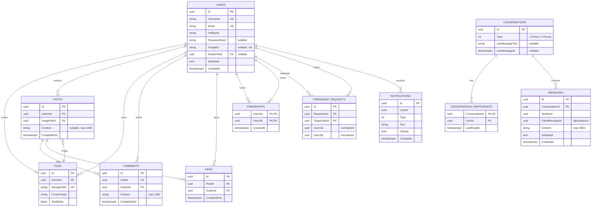

# Transcendence

> A modern, full-stack social platform built as the **ft_transcendence** capstone project at **42 Vienna**.

Transcendence is a private social application that brings together authentication, profiles, posts, comments, likes, friend management, file uploads, notifications, and real-time chat under a single, coherent product. The repository is split into a strongly-typed React frontend and a layered .NET backend, glued together by an OpenAPI-driven contract.

---

## Table of contents

1.  [Project at a glance](#project-at-a-glance)
2.  [Team](#team)
3.  [Project management](#project-management)
4.  [Selected modules and point calculation](#selected-modules-and-point-calculation)
5.  [Features and ownership](#features-and-ownership)
6.  [Technology stack and justifications](#technology-stack-and-justifications)
7.  [Architecture overview](#architecture-overview)
8.  [Database schema](#database-schema)
9.  [Individual contributions](#individual-contributions)
10. [Getting started](#getting-started)
11. [Repository structure](#repository-structure)
12. [Running the application](#running-the-application)
13. [Database operations](#database-operations)
14. [API overview](#api-overview)
15. [Frontend notes](#frontend-notes)
16. [Security considerations](#security-considerations)
17. [Troubleshooting](#troubleshooting)
18. [Credits and license](#credits-and-license)

---

## Project at a glance

| | |
|---|---|
| **Name** | Transcendence |
| **School** | 42 Vienna |
| **Project** | ft_transcendence |
| **Team size** | 4 |
| **Total points** | 14 |
| **Live demo** | https://localhost:8443 |

## Team

| Member | Role | GitHub | Primary focus |
|---|---|---|---|
| **Deniz** | **Product Owner (PO) & Project Manager (PM)** [@denniscingoz](https://github.com/denniscingoz) | Vision, scope, acceptance criteria | Design | Planning, coordination, delivery |
| **Daria** | **Tech Lead** | [@grignetta](https://github.com/grignetta) | Architecture, code review, technical direction, database |
| **Valerii** | **Backend Developer** | [@Vbezhevets](https://github.com/Vbezhevets) | Realtime features with SignalR |
| **Michaela** | **Frontend Developer** | [@michaela811](https://github.com/michaela811) | Frontend application |

> _Roles were assigned at kickoff and remained stable through the project. All members contributed to code, and everyone tested the system and fixed bugs across the codebase; the role headings indicate primary responsibility, not exclusive ownership._

---

## Project management

Given the small team size and fixed academic deadline, we kept coordination deliberately lightweight. Day-to-day communication happened in a shared WhatsApp group, with occasional calls for deeper discussions or design decisions. Roles were assigned at kickoff and everyone contributed to code, testing, and bug fixing.

### How work was organised

- **Discovery phase (week 1).** Requirements walk-through, scope agreement, module selection, and a target point total. Wireframes and a domain model were produced before any code was written.
- **API-first contract.** Backend and frontend agreed on endpoint shapes, payloads, and auth flows **before** parallel implementation began. This single decision unblocked nearly all parallel work.
- **Documentation discipline.** `docs/` is split by audience - `api/`, `back end/`, `front/`, `db_schema/`, and `minor/`. Cross-module dependencies were tracked in `Dependency map.pages` so we always knew the impact radius of a change.
- **Task tracking.** Work items were captured as GitHub issues against the repo and assigned at kickoff, then reallocated as scope shifted. We did not run formal sprints, coordination was continuous rather than time-boxed.
- **Branching strategy.** Trunk-based development with short-lived feature branches, pull requests into `main`, and review before merge to keep history readable.
- **Communication.** Async-first via a shared WhatsApp group for day-to-day coordination: blockers, asks, progress updates, supplemented by occasional calls for design discussions and harder problem solving. This kept overhead low and let each member work in long uninterrupted blocks.
- **Quality gates.** Pre-commit linting on the frontend, EF Core migrations reviewed by the Tech Lead or Project owner before merge, and code review on every pull request. All members contributed to testing and bug fixing across the codebase.
- **Deployment workflow.** Local development through Docker Compose; production-like environment behind Nginx with self-signed TLS for end-to-end testing of the SignalR chat layer.

### Tooling

- **Source control:** Git + GitHub
- **Tracking:** _GitHub Projects Issues_
- **Communication:** _Whatsapp group_
- **Design:** _Figma_
- **Documentation:** in-repo Markdown under `docs/`

---

## Selected modules and point calculation

ft_transcendence requires **14 points minimum** to pass, where:

- **1 Major module = 2 point**
- **2 Minor modules = 1 point**

We selected **4 Major** and **7 Minor** modules for a total of **15 points**.

### Major modules (4 × 2 = 8.0 points)

| # | Module | How we satisfied it |
|---|---|---|
| **M1** | **Use a framework for both frontend and backend** | React + Vite + TypeScript on the frontend; ASP.NET Core Web API on the backend. Both go beyond minimal usage (routing, dependency injection, middleware, custom hooks). |
| **M2** | **Real-time features (WebSockets / similar)** | **SignalR** powers the chat hub at `/hubs/chat`, with graceful reconnection, typing indicators, and presence updates broadcast efficiently to relevant clients only. |
| **M3** | **Users can interact with each other** | Chat (1:1 conversations), profile pages (own + others), and a complete friends system (request, accept/decline, remove, online status). |
| **M4** | **Standard user management and authentication** | JWT-based auth, profile editing, avatar upload (with a default fallback), online status, friend management, and a public profile page per user. |

### Minor modules (6 × 1 = 6.0 points)

| # | Module | How we satisfied it |
|---|---|---|
| **m1** | **Complete notification system** | Notifications generated for create/update/delete actions across friends, posts, comments, likes, and chat. Includes an unread counter and a mark-as-read endpoint. |
| **m2** | **File upload and management** | Multi-type upload (images, documents), client-side **and** server-side validation (type, size, format), secure storage with access control, image previews, upload progress, and deletion. |
| **m3** | **Multi-language support (≥ 3)** | i18next-powered i18n with **3 complete translations** EN, ES, FR, a UI language switcher, and 100% coverage of user-facing strings. |
| **m4** | **Remote authentication (OAuth 2.0)** | Google sign-in via OAuth 2.0, integrated with the JWT issuance flow so federated and local accounts share a single identity model. |
| **m5** | **Custom-made design system** | A reusable component library with a defined colour palette, typography scale, and icon set. **≥ 10 reusable components** (Button, Input, Modal, Card, Avatar, Toast, Tabs, Dropdown, Spinner, Badge, …) built on Tailwind tokens. |
| **m6** | **Use an ORM** | **Entity Framework Core** with code-first migrations, applied automatically on API startup. |

---

## Features and ownership

| Area | Feature | Owner | Status |
|---|---|---|---|
| **Auth** | Email/password sign-up & sign-in (UI) | Michaela (FE) / _[Name]_ (BE) | ✅ |
| | Google OAuth 2.0 sign-in | Michaela (FE) / _[Name]_ (BE) | ✅ |
| | JWT handling, refresh, sign-out | Michaela (FE) / _[Name]_ (BE) | ✅ |
| | 2FA enrolment + verification | _[Name]_ | ✅ / _[remove if N/A]_ |
| **Profile** | View own profile | Michaela (FE) / _[Name]_ (BE) | ✅ |
| | View other users' profiles | Michaela (FE) / _[Name]_ (BE) | ✅ |
| | Edit profile + change password | Michaela (FE) / _[Name]_ (BE) | ✅ |
| | Avatar upload with default fallback | Michaela (FE) / _[Name]_ (BE) | ✅ |
| | Account deletion | Michaela (FE) / _[Name]_ (BE) | ✅ |
| | User search | Michaela (FE) / _[Name]_ (BE) | ✅ |
| **Posts** | Feed | Michaela (FE) / _[Name]_ (BE) | ✅ |
| | Profile posts | Michaela (FE) / _[Name]_ (BE) | ✅ |
| | Create / delete post | Michaela (FE) / _[Name]_ (BE) | ✅ |
| | Comments | Michaela (FE) / _[Name]_ (BE) | ✅ |
| | Likes | Michaela (FE) / _[Name]_ (BE) | ✅ |
| **Friends** | Send / accept / decline requests | Michaela (FE) / _[Name]_ (BE) | ✅ |
| | Friends list + remove friend | Michaela (FE) / _[Name]_ (BE) | ✅ |
| | Online status indicator | Michaela (FE) / _[Name]_ (BE) | ✅ |
| **Files** | Upload + validation (type/size) | Michaela (FE) / _[Name]_ (BE) | ✅ |
| | Protected access control | _[Name]_ (BE) | ✅ |
| | Image preview + progress | Michaela | ✅ |
| | Delete uploaded files | Michaela (FE) / _[Name]_ (BE) | ✅ |
| **Notifications** | Create / read events | Michaela (FE) / _[Name]_ (BE) | ✅ |
| | Unread counter | Michaela (FE) / _[Name]_ (BE) | ✅ |
| | Mark as read | Michaela (FE) / _[Name]_ (BE) | ✅ |
| **Chat** | Real-time messaging via SignalR | Michaela (FE) / _[Name]_ (BE) | ✅ |
| | Conversation list + history | Michaela (FE) / _[Name]_ (BE) | ✅ |
| | Reconnection / disconnection handling | Michaela (FE) / _[Name]_ (BE) | ✅ |
| **i18n** | Translation files (3 languages) | Michaela | ✅ |
| | Language switcher | Michaela | ✅ |
| **Design system** | 10+ reusable components | _[Name]_ | ✅ |
| **Infra** | Docker Compose + Nginx reverse proxy | _[Name]_ | ✅ |
| | Local TLS certs | _[Name]_ | ✅ |
| | DB backup / restore scripts | _[Name]_ | ✅ |

---

## Technology stack and justifications

### Backend — .NET / ASP.NET Core

| Choice | Why |
|---|---|
| **ASP.NET Core Web API** | Mature, cross-platform, opinionated. Strong typing end-to-end and excellent OpenAPI tooling support. |
| **C# / .NET** | Performance, a rich BCL, and first-class async — ideal for WebSocket-heavy workloads. |
| **Entity Framework Core** | Code-first migrations, LINQ queries, and a strict mapping layer between domain models and persistence — directly satisfies the **ORM minor module**. |
| **SignalR** | Battle-tested abstraction over WebSockets with built-in fallback, group/user targeting, and reconnection — drastically reduces the surface area of the **real-time major module**. |
| **JWT bearer auth** | Stateless, plays well with SPAs, and integrates cleanly with both local and Google OAuth identity flows. |
| **Swagger / OpenAPI** | Auto-generated, always-current API contract — used by the frontend's typed clients. |

### Frontend — React + TypeScript

| Choice | Why |
|---|---|
| **React + Vite** | Fast dev server, instant HMR, ecosystem maturity. Vite's ESM-native dev experience is materially faster than CRA/webpack for a project this size. |
| **TypeScript** | Catches whole classes of bugs at compile time, especially around API payload shapes. Pairs well with the OpenAPI-generated types. |
| **React Router** | Declarative routing with nested routes, naturally maps to our protected-route model via `RequireAuth`. |
| **TanStack Query** | Eliminates almost all of the boilerplate around server state (cache, dedupe, retries, refetch), and makes optimistic updates straightforward. |
| **Axios** | Interceptors for token attachment, refresh, and centralised error handling. |
| **i18next** | Industry-standard i18n with namespace splitting, pluralisation, and runtime language switching — directly satisfies the **multi-language minor module**. |
| **MSW** | Lets the frontend run end-to-end without the backend, which unblocked parallel work and gave us a reliable demo fallback. |
| **Tailwind CSS** | Utility-first, design-system-friendly. Tailwind tokens back our **custom design system minor module**. |

### Infrastructure

| Choice | Why |
|---|---|
| **Docker Compose** | One-command spin-up for the database, API, and reverse proxy. Reproducible across team machines. |
| **Nginx** | Reverse proxy, TLS termination, and WebSocket upgrade handling for SignalR. |
| **PostgreSQL 16** | Mature, strict, and a great fit for the relational shape of our domain (users, friendships, posts, comments). |
| **Self-signed dev certificates** | Necessary for testing TLS and secure WebSocket flows locally without a public domain. |

---

## Architecture overview

```
┌──────────────────────┐        ┌──────────────────────────┐
│      Browser         │        │          Nginx           │
│  React SPA (Vite)    │ HTTPS  │   reverse proxy + TLS    │
│  TanStack Query      │ ─────► │   /api  → API container  │
│  SignalR client      │  WSS   │   /hubs → API container  │
└──────────────────────┘        │   /     → static SPA     │
                                └────────────┬─────────────┘
                                             │
                                             ▼
                       ┌─────────────────────────────────────┐
                       │     Transcendence.Api (ASP.NET)     │
                       │  Controllers · SignalR Hubs · Auth  │
                       └─────────────────┬───────────────────┘
                                         │
                                         ▼
                       ┌─────────────────────────────────────┐
                       │      Transcendence.Application      │
                       │   Service contracts · use cases     │
                       └─────────────────┬───────────────────┘
                                         │
                          ┌──────────────┴──────────────┐
                          ▼                             ▼
            ┌─────────────────────────┐   ┌──────────────────────────┐
            │  Transcendence.Domain   │   │ Transcendence.Infra      │
            │  Entities · core models │   │ EF Core · repos · files  │
            └─────────────────────────┘   └──────────────┬───────────┘
                                                         │
                                                         ▼
                                              ┌────────────────────┐
                                              │   PostgreSQL 16    │
                                              └────────────────────┘
```

**Why this layering?** It keeps the domain pure (no framework dependencies), pushes I/O concerns to the edges, and makes the API surface trivially testable. New features almost always slot in cleanly without cascading changes.

---

## Database schema



# Architecture

Project Transcendence is a social platform whose database is organized around **five domains**: identity, social feed, friendships, chat, and notifications. All tables live in PostgreSQL under the `app` schema and are managed via EF Core migrations applied automatically at API startup.

## Identity

Identity is the foundation. Every `users` row supports either password or Google SSO authentication, enforced by a check constraint requiring at least one of `PasswordHash` or `GoogleId` to be set. Each user links optionally to an avatar in the `files` table.

`files` itself is a generic blob registry — every uploaded asset gets a row, owned by a user, with cascade deletion when that user is removed.

## Social Feed

The social feed is a classic **posts / comments / likes** triangle:

- A post **must** carry an image. The FK to `files` uses `RESTRICT` so you can't orphan a post by deleting its image.
- The `likes` table has a unique index on `(PostId, AuthorId)`, so a user can only like a given post once.
- Cascading deletes on `PostId` clean up comments and likes when a post is removed.

## Friendships

Friendships use a **pair-normalization trick**. Both `Friendships` and `FriendshipRequests` enforce `User1Id < User2Id` so each pair exists exactly once in canonical order. This has two payoffs:

- "Are A and B friends?" becomes a single index lookup instead of an OR query.
- A→B and B→A friend requests collide on a unique index — you can't have two pending requests between the same two users.

The **original direction** of a request is preserved separately via `RequesterId` and `TargetUserId`. Self-friendships are blocked by `CHECK (RequesterId <> TargetUserId)`.

## Chat

Chat supports both **direct (1-to-1)** and **group** conversations via a `Type` discriminator on `Conversations`. Participation is a join table with per-user `LastReadAt` for cheap unread-count queries.

Messages carry a client-generated `ClientMessageId` so **retries are idempotent**: the unique index on `(SenderId, ClientMessageId)` means the second copy of a retried send collides on insert and the original is returned, instead of producing duplicates.

Deleted messages are **soft-deleted** (`IsDeleted` + `DeletedAt`) to keep threading and read pointers consistent.

## Notifications

Notifications **denormalize actor metadata** (`ActorUsername`, `ActorAvatarUrl`) directly onto each row, so the feed renders without joins — even if the actor later changes their username or avatar. A typed `Type` column distinguishes the six notification kinds: new message, friend request, accepted, declined, post liked, post commented.

---

## Individual contributions

### Michaela — Frontend Developer

Sole owner of the frontend application end-to-end.

- **Application shell & routing.** Set up the Vite + React + TypeScript project, the routing tree, the `RequireAuth` protected-route wrapper, and the `RealtimeProvider` that mounts the SignalR client at the right point in the lifecycle.
- **API integration layer.** Built every typed API client under `src/api/`, the Axios instance with token attachment and centralised error handling, and the TanStack Query hooks that consume them.
- **Authentication flows.** Email/password sign-in, Google OAuth 2.0 sign-in, sign-out, JWT handling, and session restoration on reload.
- **Custom design system.** Built the reusable component library (Button, Input, Modal, Card, Avatar, Toast, Tabs, Dropdown, Spinner, Badge, …) on top of Tailwind tokens — directly satisfying the **custom design system** Minor module.
- **Feature pages.** Feed, post creation, post detail, comments, likes, profile (own + others), edit profile, settings, friends, friend requests, and online status indicators.
- **Real-time chat UI.** Conversation list, message thread, send/receive, reconnection handling, and presence integration with the SignalR client.
- **Notifications UI.** Inbox, unread counter, mark-as-read, and surface integration across the app.
- **File uploads.** Client-side validation (type/size/format), upload progress, image preview, and deletion flows for the **file upload and management** Minor module.
- **Internationalisation.** Wired i18next, structured the translation namespaces, produced the EN / ES / FR translation files, and built the language switcher — covering the **multi-language** Minor module.
- **Mock-mode harness.** Set up MSW so the frontend could run end-to-end without the backend, which unblocked parallel work and gave us a reliable demo fallback.
- **Tooling.** ESLint config, Tailwind tokens, TypeScript strict-mode setup, and the `frontend/.env` contract.

### Deniz — Product Owner | Project Manager

- **Major contributions:**
  - _[e.g. "Designed the friends-graph data model and authored migrations `2025_01_03_AddFriendships` … `2025_01_22_AddFriendBlockList`."]_
  - _[e.g. "Implemented the SignalR chat hub including reconnection logic and typing indicators."]_
- **Key PRs:** `#12`, `#34`, `#56`
- **Cross-cutting work:** Code review, scope arbitration, demo prep.

### Daria — Tech Lead

- **Major contributions:**
  - _[e.g. "Established the layered architecture (Api / Application / Domain / Infrastructure) and wrote the initial EF Core configuration."]_
  - _[e.g. "Implemented JWT issuance and the Google OAuth integration."]_
- **Key PRs:** `#3`, `#5`, `#28`
- **Cross-cutting work:** Architecture decisions, performance review, code-review backbone.

### Valerii — Backend Developer

- **Major contributions:**
  - _[e.g. "Built the full file upload and management module: client validation, multipart endpoints, secure storage, and the deletion flow."]_
  - _[e.g. "Implemented the notifications pipeline end-to-end."]_
- **Key PRs:** `#22`, `#33`, `#48`

---

## Getting started

### Requirements

| Tool | Version |
|---|---|
| Docker + Docker Compose | latest stable |
| Node.js | 18+ |
| npm | 9+ |
| .NET SDK | 8.0 |

For the Docker-based flow, Docker is the only hard requirement. The frontend can also be run separately with Vite during development.

### Environment setup

Create the root environment file:

```bash
cp .env.example .env
```

Then update the values in `.env`:

```env
POSTGRES_DB=trans_db
POSTGRES_USER=postgres
POSTGRES_PASSWORD=change_me
JWT_KEY=change_me_to_a_long_random_secret_key
JWT_ISSUER=TranscendenceApi
JWT_AUDIENCE=TranscendenceFrontend
JWT_EXPIRY_MINUTES=60
GOOGLE_CLIENTID=your_google_client_id_here
```

For the frontend:

```bash
cd frontend
cp .env.example .env
```

Example frontend values:

```env
VITE_USE_MOCKS=false
VITE_GOOGLE_CLIENT_ID=your_google_client_id_here
VITE_API_BASE_URL=/api
```

> **Never commit real secrets.** The `.env` files are git-ignored. Rotate `JWT_KEY` and your Google client secret if they ever leak.

---

## Repository structure

```text
.
├── backend/
│   ├── Transcendence.Api/              # HTTP API, controllers, SignalR hubs
│   ├── Transcendence.Application/      # Use cases, service contracts
│   ├── Transcendence.Domain/           # Entities, core models, business rules
│   ├── Transcendence.Infrastructure/   # EF Core, repositories, persistence, storage
│   └── Transcendence.sln
├── backups/                            # DB dumps (git-ignored)
├── docker/
│   ├── nginx/
│   │   ├── certs/                      # Local development TLS certificates
│   │   ├── default.conf                # Reverse proxy + WebSocket upgrade rules
│   │   └── Dockerfile
│   └── scripts/
│       ├── check-env.sh                # Verifies required env vars are present
│       ├── generate-certs.sh           # Issues local self-signed certs
│       ├── backup-db.sh                # pg_dump wrapper
│       └── restore-db.sh               # pg_restore wrapper
├── docs/
│   ├── api/                            # Endpoint contracts, payload shapes
│   │   ├── auth/
│   │   ├── chats/
│   │   ├── common/
│   │   ├── feed/
│   │   ├── notifications/
│   │   ├── profile/
│   │   ├── search/
│   |   └── openapi.yaml
│   ├── back end/                       # Backend design notes
│   │   ├── chat/
│   │   ├── OpenApi
│   ├── db_schema/                      # ER diagrams, schema drafts
│   ├── front/                          # Frontend design notes
│   ├── minor/                          # Notes per minor module
│   ├── DB entities -> api.md                        
│   ├── DB Entities.md
│   ├── en.subject_Transcendence.pdf    # 42 subject reference
│   ├── SOCIAL MEDIA Features.jpg
│   └── User scenarios.md
├── frontend/
│   ├── public/                         # Static assets
│   ├── src/
│   │   ├── api/
│   │   ├── app/
│   │   ├── auth/
│   │   ├── components/
│   │   ├── hooks/
│   │   ├── i18n/
│   │   ├── mocks/
│   │   ├── pages/
│   │   ├── realtime/
│   │   ├── types/
│   │   ├── utils/
│   │   ├── index.css
│   |   └── main.tsx
│   ├── .env.example
│   ├── eslint.config.js
│   ├── index.html
│   ├── package.lock.json
│   ├── package.json
│   ├── postcss.config.js
│   ├── tailwind.config.js
│   ├── tsconfig.json
│   ├── tsconfig.node.json
│   └── vite.config.ts
├── uploads/                            # Locally uploaded files (git-ignored)
├── .dockerignore
├── .env.example
├── .gitignore
├── API-First PLAN Backend–Frontend Collaboration (Draft).md
├── Dependency map.pages                # Cross-module dependency map
├── docker-compose.yml
├── Makefile
├── README.md
└── The-Social_Flow-Tecnical-Tools.pdf  # Technical tooling reference
```

---

## Running the application

### With Docker (recommended)

From the repository root:

```bash
make up
```

This will:

1. check that the root `.env` file exists;
2. generate local development certificates if needed;
3. build and start the database, API, and Nginx containers.

Useful targets:

```bash
make down        # stop containers
make build       # rebuild services
make clean       # stop and remove orphan containers
make fclean      # remove containers, volumes, certs, and uploads
make re          # clean and start again, keeping the DB volume
```

The API runs behind Nginx. PostgreSQL 16 is exposed locally on port `5432`.

### Frontend only (Vite dev server)

```bash
cd frontend
npm install
npm run dev
```

Other frontend commands:

```bash
npm run build     # production build
npm run lint      # ESLint
npm run preview   # preview the production build
```

---

## Database operations

EF Core migrations live in `backend/Transcendence.Infrastructure/Migrations` and are applied automatically on API startup.

Helper commands:

```bash
make backup-db
make restore-db
make db-up
make restore-up
```

Backups land in `backups/`. **Never commit real database dumps or uploaded media.**

---

## API overview

Swagger is enabled in development. Once the API is running, open Swagger UI from the API host.

API notes and schema drafts also live in:

```text
docs/api/
docs/back end/
docs/db_schema/
```

### Main API areas

| Area | Endpoints |
|---|---|
| `auth` | sign up, sign in, sign out, Google sign-in |
| `profile` | own profile, others' profiles, profile update, password change, account deletion, search |
| `posts` | feed, profile posts, post detail, comments, likes, create/delete |
| `friends` | list, requests, accept/decline, remove |
| `files` | upload, read, avatar access, delete |
| `notifications` | list, unread count, mark as read |
| `conversations` | conversations and messages |
| `hubs/chat` | SignalR chat hub |

---

## Frontend notes

The frontend is organised around pages, reusable hooks, and small API clients. Protected app routes are wrapped with `RequireAuth`, and real-time features are mounted through `RealtimeProvider`.

### Main routes

| Route | Purpose |
|---|---|
| `/signin` | Sign in (email/password + Google) |
| `/feed` | Main feed |
| `/profile` | Own profile |
| `/profile/:userId` | Other users' profiles |
| `/friends` | Friend management |
| `/chat` | Real-time chat |
| `/edit-profile` | Edit profile |
| `/settings` | Account settings |
| `/post-create` | New post |
| `/terms-service` | Terms of Service |
| `/privacy-policy` | Privacy Policy |

### Mock mode

Run the frontend against MSW-mocked endpoints by setting:

```env
VITE_USE_MOCKS=true
```

---

## Security considerations

- **Transport.** All traffic is served over HTTPS in development (self-signed) and is expected to be over HTTPS in any deployment.
- **Authentication.** JWT is signed with a high-entropy key from `JWT_KEY`. Tokens have a short lifetime (`JWT_EXPIRY_MINUTES`) and are never stored in `localStorage`-exposed positions; refresh handling is centralised in the Axios interceptor.
- **Authorization.** All non-public API routes require a bearer token. SignalR hubs reuse the same auth pipeline.
- **OAuth.** Google sign-in is verified server-side; we never trust client-supplied identity claims.
- **File uploads.** Validated on both client and server (MIME, size, extension). Files are stored outside the web root and served through an authenticated endpoint.
- **Database.** Parameterised queries via EF Core; no raw SQL on user input. Migrations are reviewed.
- **Secrets.** All credentials live in `.env` files which are git-ignored. `.env.example` is the only committed template.
- **CORS.** Configured to allow only the frontend origin in production.

---

## Troubleshooting

| Symptom | Likely cause | Fix |
|---|---|---|
| `make up` fails complaining about missing certs | First run on a new machine | Re-run `make up`; the cert script generates them automatically |
| API container restarts on startup | DB not yet ready when the API tries to migrate | Wait ~10 seconds; otherwise `docker compose logs api` to see the actual error |
| Google sign-in shows "redirect_uri_mismatch" | OAuth client config doesn't list your local URL | Add `https://localhost` (and the port) as an authorised redirect URI in Google Cloud Console |
| Chat connects but messages don't broadcast | Nginx not upgrading WebSockets | Confirm `Upgrade` / `Connection` headers in `docker/nginx/*.conf` |
| `npm run dev` proxy errors | Backend not running, or `VITE_API_BASE_URL` wrong | Start the API (`make up`) and verify `frontend/.env` |
| Migrations fail with "relation does not exist" | DB volume out of sync after a schema reset | `make fclean && make up` (destroys local data) |

---